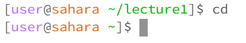

# Lab 1
## ls
ls with no arguments shows the contents of the current directory, which in this case is `/home`. The command works as intended and does not produce an error.

ls with a directory as an argument shows the contents of that directory, which in this case is `/home/lecture1`. The command works as intended and does not produce an error.

ls with a file as an argument just shows the path to that directory, whichin this case is `/home/lecture1/README`. The command works as intended and does not produce an error. 

## cd
cd with no arguments does nothing, it just leaves the current working directory as `/home`. The command works as intended and does not produce an error. 

cd with a directory as an argument changes the current working directory, in this case the argument given was `/home/lecture1`. The command works as intended and does not produce an error

cd with a file as an argument produces an error. This is because change directory uses a path to a directory as an argument, so passing in a path to a file produces an error.

## cat
cat with no arguments waits for user input and then outputs what the user types. To exit, use `ctrl + d`. The command works as intended and does not produce an error.

cat with a directory as an argument states that the directory is a directory, in this case `/home/lecture1`. The command works as intended and does not produce an error.

cat with a file outputs the contents of that file, in this case the contents of `/home/lecture1/README`. The command works as intended and does not produce an error.

