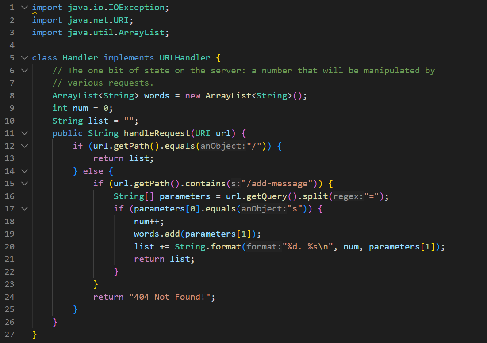
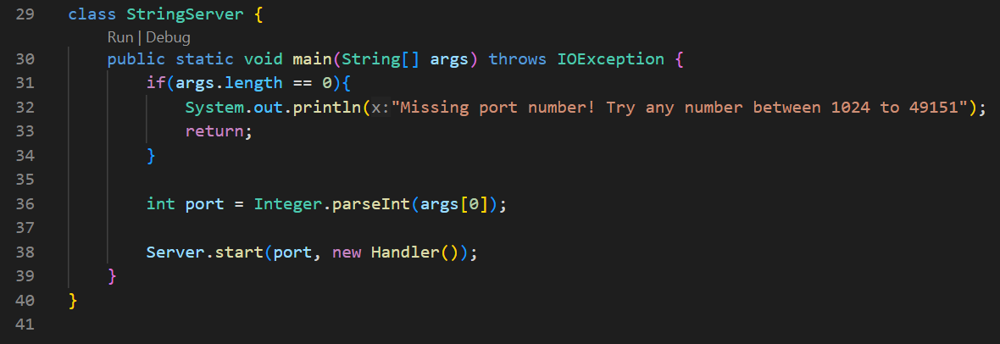

# Lab 2

## Part 1

`StringServer.java` code:

StringServer:

## Part 2

File containing SSH key: 

Path to private key:

`C:\Users\Angela\.ssh\id_rsa`

Path to public key:

`C:\Users\Angela\.ssh\id_rsa.pub`

## Part 3

In lab, I learned that an SSH key can be used to ssh into a remote server without a password. I also learned that SCP can be used to copy files between remote and local servers.

