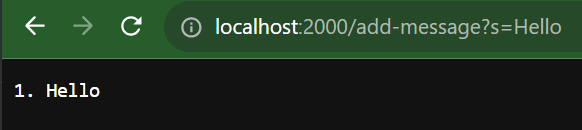
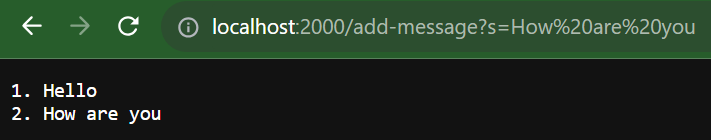
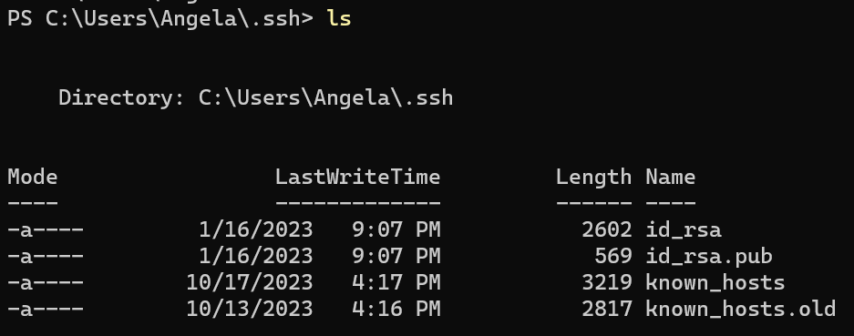
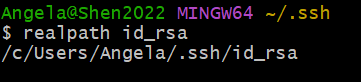
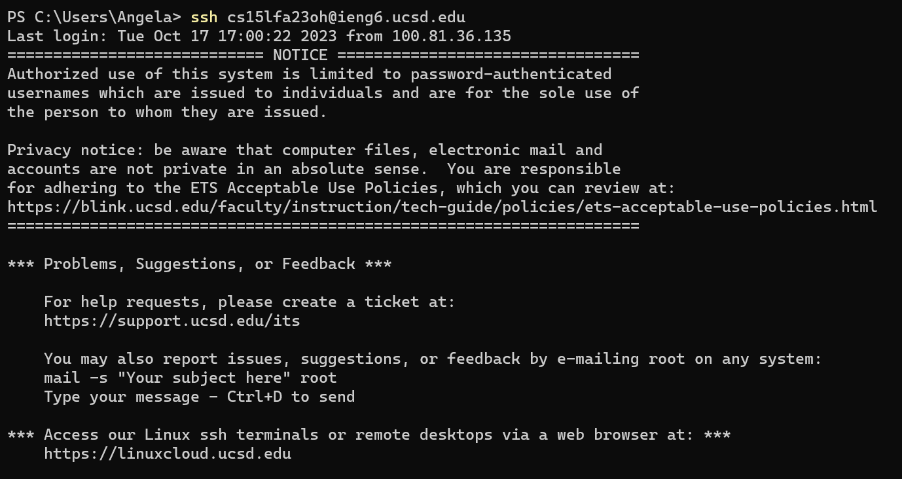

# Lab 2

## Part 1

`StringServer.java` code:
```
import java.io.IOException;
import java.net.URI;
import java.util.ArrayList;

class Handler implements URLHandler {
    // The one bit of state on the server: a number that will be manipulated by
    // various requests.
    ArrayList<String> words = new ArrayList<String>();
    int num = 0;
    String list = "";
    public String handleRequest(URI url) {
        if (url.getPath().equals("/")) {
            return list;
        } else {
            if (url.getPath().contains("/add-message")) {
                String[] parameters = url.getQuery().split("=");
                if (parameters[0].equals("s")) {
		            num++;
                    words.add(parameters[1]);
                    list += String.format("%d. %s\n", num, parameters[1]);
		            return list;
                }
            }
            return "404 Not Found!";
        }
    }
}

class StringServer {
    public static void main(String[] args) throws IOException {
        if(args.length == 0){
            System.out.println("Missing port number! Try any number between 1024 to 49151");
            return;
        }

        int port = Integer.parseInt(args[0]);

        Server.start(port, new Handler());
    }
}
```

StringServer:



- The method handleRequest is called (the main method is not called because the server has already been started).
- The relevant arguments are the `URI url` argument. The path of the `url` argument is read and the text after the query is added to the string list `parameters`. The relevant values are the previously mentioned `String[] parameters`, `int num`, which gives the number of arguments in the list, `ArrayList<String>`, which contains a list of any previously queried words, and `String list`, which is the formatted string of items in the list.
- The `String[] parameters` is changed to have the text after the query from the argument `URI url`, which in this case is `s=Hello`, so `parameters` becomes `['s', 'Hello']`. The elements of `String[] parameters` are evaluated and then the second element of the query (`'Hello'`) is added to `ArrayList<String> words`, the `int num` is incremented to indicate there is 1 more item in `words`, and the formatted `String list` is changed to account for the new word.



- The method handleRequest is called (the main method is not called because the server has already been started).
- The relevant arguments are the `URI url` argument. The path of the `url` argument is read and the text after the query is added to the string list `parameters`. The relevant values are the previously mentioned `String[] parameters`, `int num`, which gives the number of arguments in the list, `ArrayList<String>`, which contains a list of any previously queried words, and `String list`, which is the formatted string of items in the list.
- The `String[] parameters` is changed to have the text after the query from the argument `URI url`, which in this case is `s=How are you?`, so `parameters` becomes `['s', 'How are you?']`. The elements of `String[] parameters` are evaluated and then the second element of the query (`'How are you?'`) is added to `ArrayList<String> words`, the `int num` is incremented to indicate there is 1 more item in `words`, and the formatted `String list` is changed to account for the new word.
## Part 2

Directory containing SSH keys: 


### Path to the FILE containing the private SSH key:



### Path to the FILE containing the public SSH key:


`ssh` in `ieng6`:



## Part 3

In lab, I learned that an SSH key can be used to ssh into a remote server without a password. I also learned that SCP can be used to copy files between remote and local servers.

