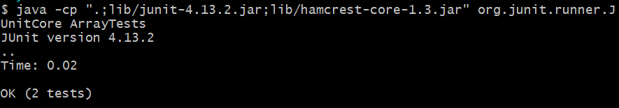
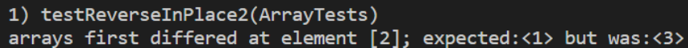

# Lab 3

## Part 1

### Solving the bug in testReverseInPlace

A failure inducing input: The array `{1, 2, 3}` 

```
@Test 
	public void testReverseInPlace() {
    int[] input1 = { 3 };
    ArrayExamples.reverseInPlace(input1);
    assertArrayEquals(new int[]{ 3 }, input1);
	}
```

An input that doesn't induce a failure: The array `{3}`

```
  @Test 
  public void testReverseInPlace2() {
    int[] input1 = { 1, 2, 3 };
    ArrayExamples.reverseInPlace(input1);
    assertArrayEquals(new int[]{ 3, 2, 1 }, input1);
	}
```

The symptom: The input array `{3}` works correctly, returning the array `{3}`. When the tests are initially run without the addition of `testReverseInPlace2`, which contains the failure inducing input, the tests pass.



However, the input array `{1, 2, 3}` causes the test `testReverseInPlace2` to fail, since the output differs from the expected output.



The bug: 

Original code:
```
static void reverseInPlace(int[] arr) {
    for(int i = 0; i < arr.length; i += 1) {
      arr[i] = arr[arr.length - i - 1];
    }
  }
```

Code after debugging:
```
static void reverseInPlace(int[] arr) {
    for(int i = 0; i < (arr.length / 2) ; i += 1) {
      int temp = arr[i];
      arr[i] = arr[arr.length - i - 1];
      arr[arr.length - i - 1] = temp;
    }
  }
```

## Part 2

`grep` command-line options (sourced from https://man7.org/linux/man-pages/man1/grep.1.html, which is a website displaying the Linux manual pages for various commands, including grep):

- `-v, --invert-match:` selects non-matching lines instead of matching lines

One of the examples from the lab involved using grep to filter for lines with the phrase "base pair", the output of which is located in `grep-plos.txt`. Hypothetically, if one were not interested in base pairs as it relates to bacteria, you could filter out bacteria.

```
$ cat grep-plos.txt
technical/plos/journal.pbio.0020190.txt:        sequence, which is a specific series of eight base pairs in the DNA of the bacterial
technical/plos/journal.pbio.0020190.txt:        chromosomes, on the order of one or two thousand base pairs of DNA (or less—their length is
technical/plos/journal.pbio.0020223.txt:        Watson-Crick base pairing, the proximity of the synthetic reactive groups elevates their
```

```
$ grep -v "bacteria" grep-plos.txt
technical/plos/journal.pbio.0020190.txt:        chromosomes, on the order of one or two thousand base pairs of DNA (or less—their length is
technical/plos/journal.pbio.0020223.txt:        Watson-Crick base pairing, the proximity of the synthetic reactive groups elevates their
```

Additionally, if we are looking for a specific files, and there are too many to search through, we can eliminate some options by excluding phrases we know aren't in the file path. `file-results.txt` contains the names of all the files in `technical/`, and using grep we can reduce the amount of lines we need to search for by filtering out the phrase `"1471"`, if we know 1471 is not in the file path.

```
$ wc find-results.txt
1402  1402 54469 find-results.txt
$ grep -v "1471" find-results.txt > find-results-v.txt

$ wc find-results-v.txt
  958   958 38713 find-results-v.txt
```

- `-f FILE, --file=FILE` will result in grep using the pattern from a file instead of a pattern given by a string.

In the lab, a file called `grep-results.txt` was used to store `grep ".txt" find-results.txt`, or in other words all the file paths in `technical/` containing `.txt`. This can also be done with a file containing the pattern `txt`. This file is called `txt.txt` in the below example. As demonstrated, they have the same number of lines, and perform the same behavior.

```
$ grep ".txt" find-results.txt > grep-results.txt
$ wc grep-results.txt
 1391  1391 54178 grep-results.txt
$ cat txt.txt
txt
$ grep -f txt.txt find-results.txt > f-grep.txt
$ wc f-grep.txt
 1391  1391 54178 f-grep.txt
```

This is probably more useful for patterns that are longer and would take a while to type out. The below pattern looks for a specific set of file paths in `find-results.txt`.
```
$ cat pattern.txt
technical/911report/chapter-13.1.txt
technical/911report/chapter-13.2.txt
technical/911report/chapter-13.3.txt
technical/911report/chapter-13.4.txt
technical/911report/chapter-13.5.txt
$ grep -f pattern.txt find-results.txt
technical/911report/chapter-13.1.txt
technical/911report/chapter-13.2.txt
technical/911report/chapter-13.3.txt
technical/911report/chapter-13.4.txt
technical/911report/chapter-13.5.txt

```

- `-g, --count` will display a count of matching input lines instead of the matching lines themselves

The below example reuses an example from the lab, showing that using `wc` on an output file of a grep command results in the same number of lines as `grep -c`

```
$ grep ".txt" find-results.txt > grep-results.txt
$ wc grep-results.txt
 1391  1391 54178 grep-results.txt
$ grep -c ".txt" find-results.txt
1391
```

Pairing `-v` with `-c` will give the number of non matching lines.
```
$ grep -v ".txt" find-results.txt > not-matching.txt
$ wc not-matching.txt
 11  11 291 not-matching.txt
$ grep -c ".txt" find-results.txt
11
```

- `-n, --line-number` gives the line number of the match, which can give a sense of where the pattern is located relative to the rest of the file's contents.

For the below example, remember that `find-results.txt` contains information about file paths in `technical/` and `grep-plot.txt` contains the lines in plos with the pattern 'base pair'.

```
$ grep -n "technical/plos/pmed.0020242.txt" find-results.txt
1390:technical/plos/pmed.0020242.txt
```

```
$ grep -n 'bacteria' grep-plos.txt
1:technical/plos/journal.pbio.0020190.txt:        sequence, which is a specific series of eight base pairs in the DNA of the bacterial
```

The line number appears before the output of the matching line, and the line numbers are 1-indexed rather than 0-indexed.
