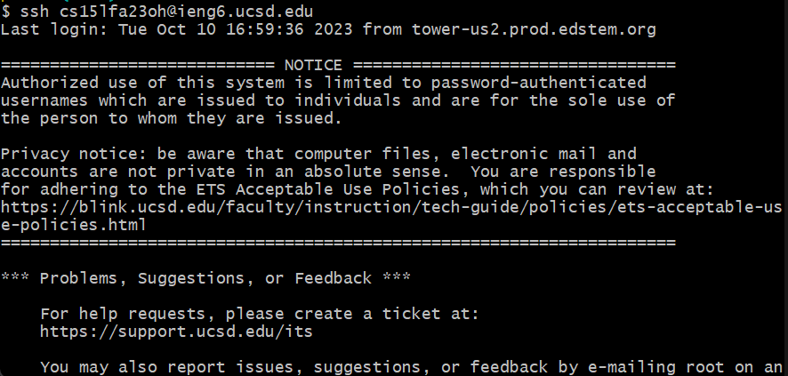
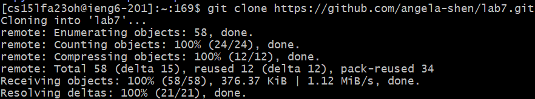
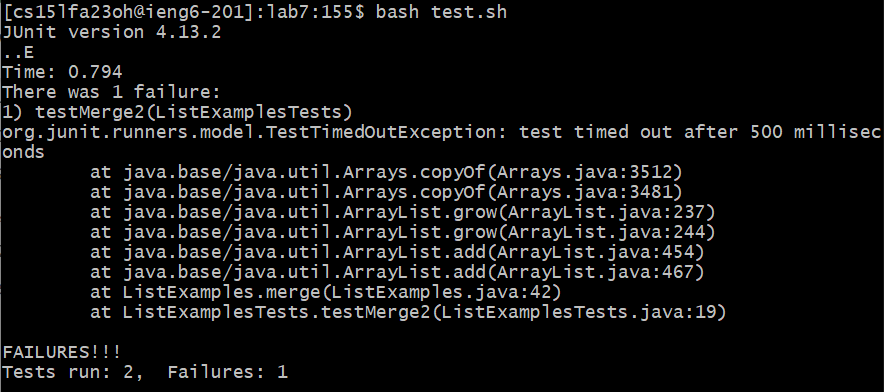

# Lab 4
## Step 4: Log into ieng6

Keys pressed: I already had the command `ssh cs15lfa23oh@ieng6.ucsd.edu` in my clipboard, so I copy pasted it by right clicking on the terminal and then used `<enter>` to run the command.

## Step 5: Clone your fork of the repository from your Github account (using the SSH URL)

Keys pressed: `<up><up><up><enter>`. The command was 3 up in the history, so I used the up arrow to access it.

## Step 6: Run the tests, demonstrating that they fail

Keys pressed: `cd lab7`, then `bash test.sh`. First I switched into the lab7 folder, then used the provided `test.sh` file to compile and run the JUnit tests. 

## Step 7: Edit the code file ListExamples.java to fix the failing test (as a reminder, the error in the code is just that index1 is used instead of index2 in the final loop in merge)
## Step 8: Run the tests, demonstrating that they now succeed
## Step 9: Commit and push the resulting change to your Github account
