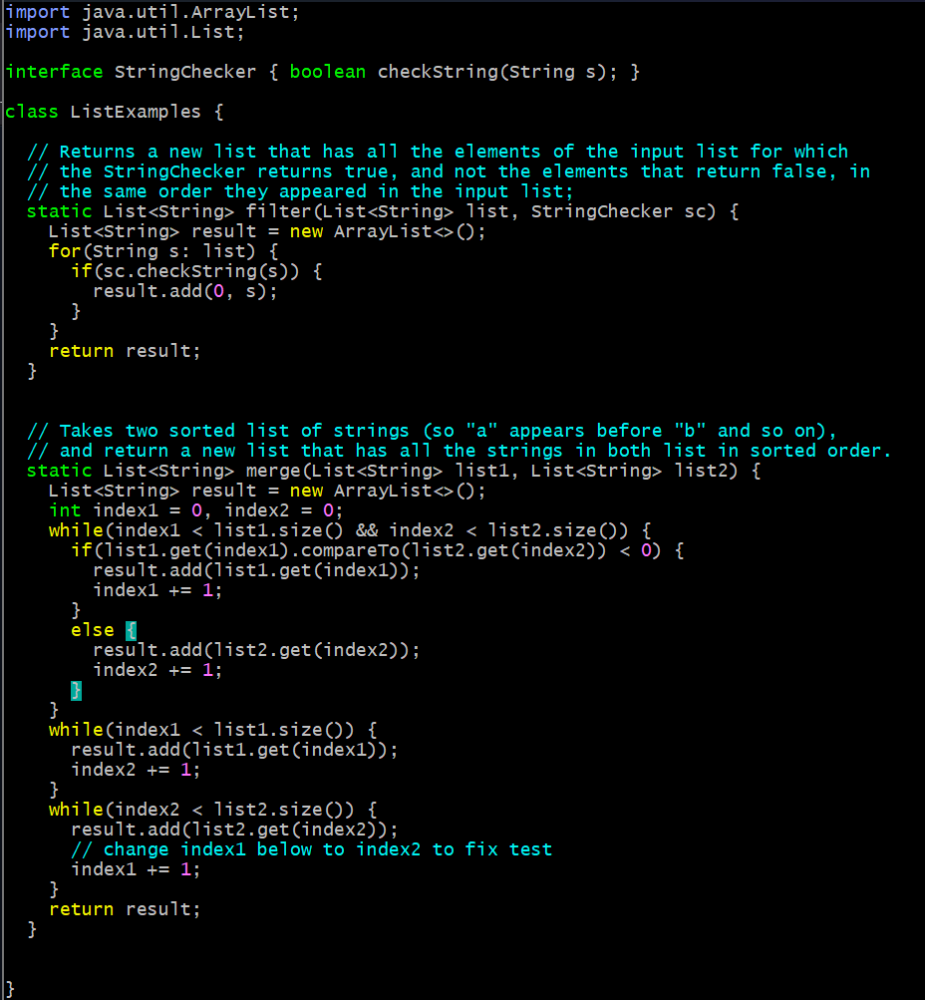

# Lab 5
## Part 1 - Ed Discussion
1. "Hi! I was fixing ListExamples.java for the lab, but now I'm getting test failures on both tests instead of just one. I'm confused as to what I did wrong. Thanks!"

2. "Hello `[student name]`, it seems like the error is occuring on two different lines for each of the test failures. Could you send a screenshot in vim of the relevant lines?"
3. "Oh, I see the problem now. I edited the wrong line when I was searching for index1 with /index1."

### The file & directory structure needed

### The contents of each file before fixing the bug

ListExamplesTests.java

ListExamples.java

test.sh

### The full command line (or lines) you ran to trigger the bug

### A description of what to edit to fix the bug

Edit line 39 to be `index1 += 1` and line 44 to be `index2 += 1`

## Part 2 - Reflection 
I really liked learning more about vim commands. I have been using vim for the past year, 
and I've probably used it more than VSCode, but I never really learned much beyond exiting, 
saving, switching between visual/insert modes, and deleting a whole line. Learning about 
searching, typing in a number to jump a certain number of lines forward/backwards, and 
using commands to delete individual words or letters was very helpful and improved my efficiency.
